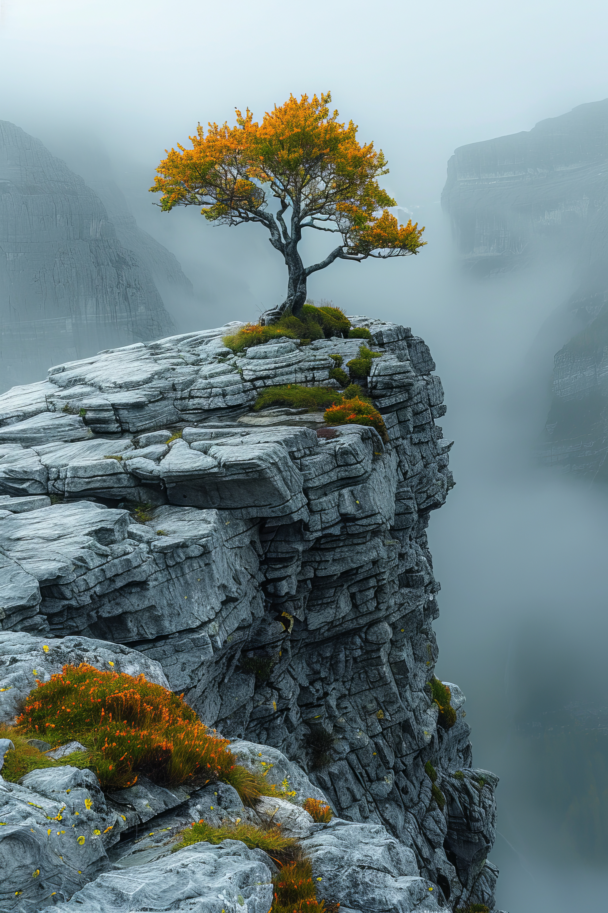
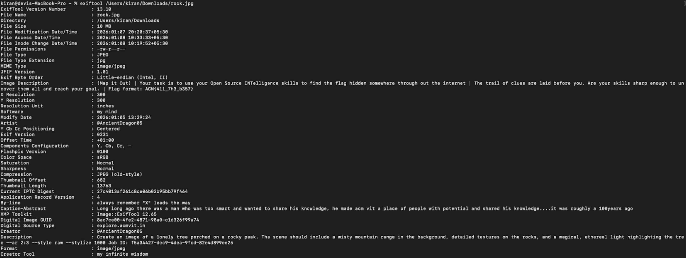
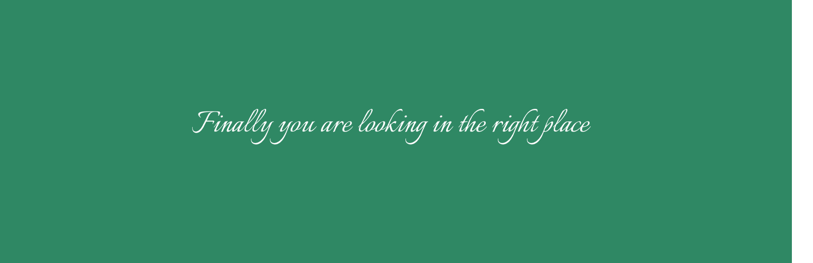
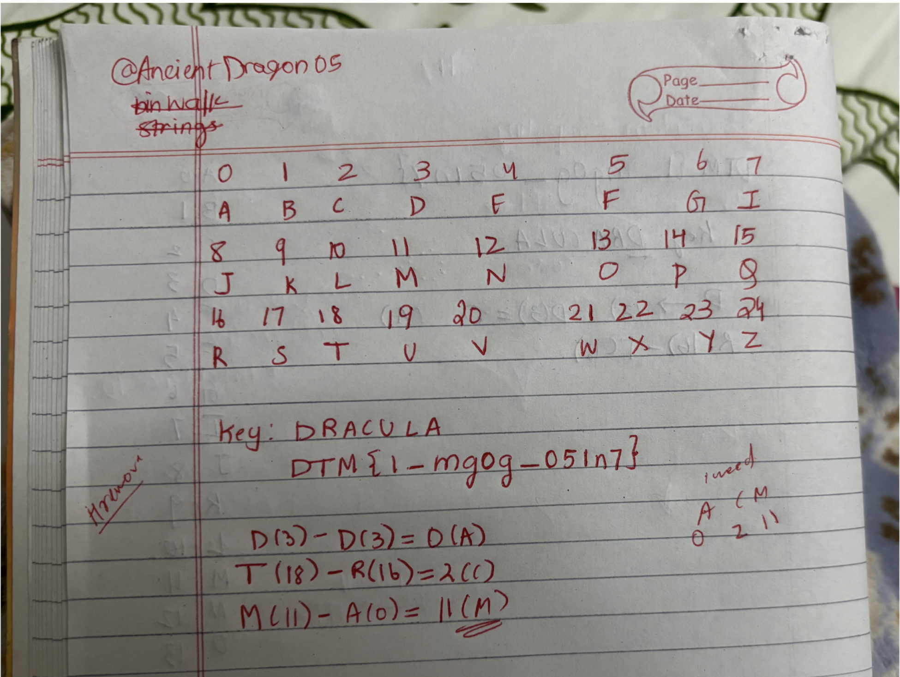
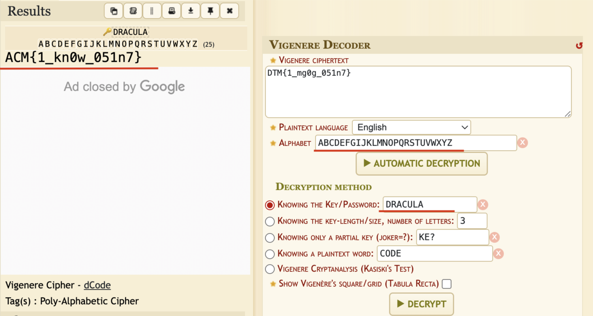

OSINT Mention the flag and submit a detailed writeup 

Summary:
I was given a file that contained an image, and was tasked to use my OSINT skills to find the CTF. This write up will contain each of the steps I took alongside my thought process, followed by clues I used and pictures of parts of the process and my results.

1) Analyzing the given file
Since I wanted to know the metadata of the file rock.jpg (originally extracted from the task document). Using ExifTool, I extracted several key pieces from the image.

Some of the points that stood out to me in the metadata I received were:

-Image Description            : (Map it Out) | Your task is to use your Open Source INTelligence skills to find the flag hidden somewhere throughout the internet | The trail of clues are laid before you. Are your skills sharp enough to uncover them all and reach your goal. | Flag format: ACM{4ll_7h3_b357}

-Software                        : my mind
-Artist                          : @AncientDragon05
-By-line                         : always remember "X" leads the way

-Caption-Abstract                : Long long ago there was a man who was too smart and wanted to share his knowledge, he made acm vit a place of people with potential and shared his knowledge....it was roughly a 100years ago

-Description                     : Create an image of a lonely tree perched on a rocky peak. The scene should include a misty mountain range in the background, detailed textures on the rocks, and a magical, ethereal light highlighting the tree --ar 2:3 --style raw --stylize 1000 Job ID: f5a34427-dec9-4dea-9fcd-82e4d899ee25

The Investigation: 
The clue “always remember "X" leads the way” led me to go onto X the social media platform and search for the Artist of the image @AncientDragon05

In this account there were multiple clues present to me from the users tweet:
“Looks like smone is close   But how close  huh”
“Ciphers are too dry maybe "vinegar" helps”
“I love "dracula"  soo much it is soo peak”
“I hate the letter "h" soo much   I feel like it should be removed from the alphabets”

In addition to this, the account had a link to  __krishang-zinzuwa.imgbb.com__
Where the following image was attached with the description: DTM{1_mg0g_051n7}

Connecting the dots:
From the clue “Ciphers are too dry maybe "vinegar" helps” I guessed that I would have to decrypt a message using the Vignere cipher.

I came back to the imgbb web to look at the description of his post. My initial try was to decrypt DTM{1_mg0g_051n7} using the website https://www.dcode.fr/vigenere-cipher
Which did not lead me anywhere as the flag format wasn’t ACM{4ll_7h3_b357}.

From the clue  “I love "dracula"  soo much it is soo peak”, and the clue “I hate the letter "h" soo much   I feel like it should be removed from the alphabets”. I tried to do the vignere decrypt myself where H was removed from the alphabets and I used Dracula as my key.

(PS this is a slightly rough work)
My logic here was to index (A-Z) without “H”, A would start at a 0 and 24 for Z. Just trying to get DTM to ACM.

Then with case sensitiveness there would be:
D, T, M 
Then D(3)- D(3) (DRACULA) = 0 (which is A)
||y, T(18)-R(16) (DRACULA)= 2(C)
M(11)-A(0) (DRACULA)= 11 (M)

Since I got ACM and realized that the vignere cipher can be used to decrypt the message with the conditions:
Key: dracula 
Alphates: ABCDEFGIJKLMNOPQRSTUWXYZ

I ran it on the website again with conditions again and received:

Result
Hence using the public information available, unveiling the metadata of the given image and connecting the clues to decrypt, the following flag was found:
ACM{1_kn0w_051n7}
